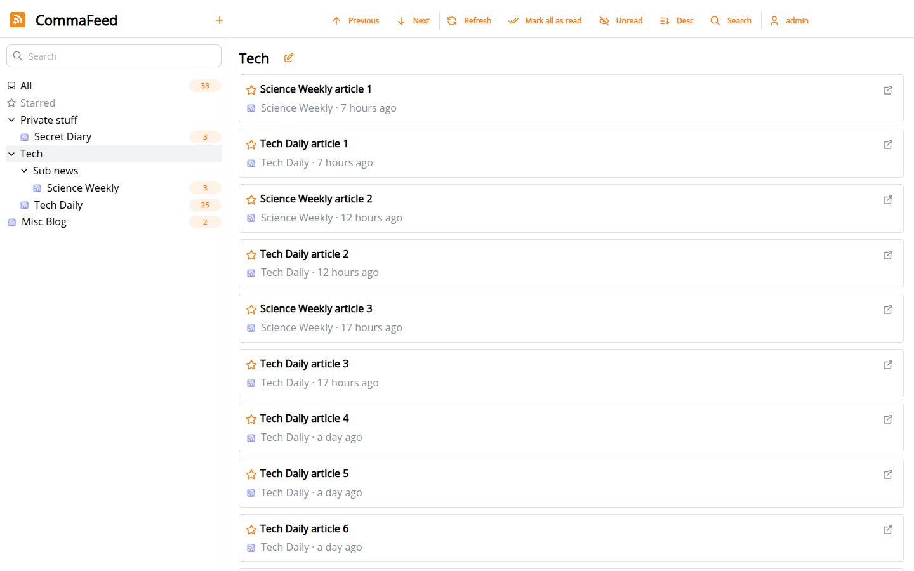

# CommaFeed

Fork of https://github.com/Athou/commafeed
Additional features comapred to original (Might not be fully up-to-date)
- Option for multiple read-only public pages, each with its own address, name and selection of categories, which can be used to share different RSS feed dashboards
- Option for MFA (TOTP or passkey) added to the login (with option to reset it)
- Additional security including the option to restrict access to the login page to specific subnets while still allowing the public pages to be reached
- Reduced memory usage

A self-hosted RSS reader with a clean, distraction-free interface. Follow your feeds from any device, share
read-only selections of them on one or more public pages, and keep your account locked down with two-factor authentication.

Fork of https://github.com/Athou/commafeed
Additional features comapred to original (Might not be fully up-to-date)
- Option for an public page which is read-only, only shows selected categories and can be used to share a specific RSS feed dashboard
- Option for MFA (TOTP or passkey) added to the login (with option to reset it)
- Additional security including the option to restrict access to the login page to specific subnets while still allowing the public page to be reached
- Reduced memory usage



## Highlights

**Reading**

- Four layouts (title only, compact, detailed, expanded), light and dark themes and a configurable accent color
- Works equally well on a phone and on a big screen
- Keyboard shortcuts for nearly everything
- Categories and subcategories, tags, starred articles and full-text search
- Rules that automatically mark articles as read
- Push notifications (ntfy, Gotify, Pushover) when new articles are published
- Right-to-left feeds, and an interface translated into 25+ languages
- OPML import and export
- Your own [CSS](documentation/CUSTOMCSS.md) and JavaScript to customize the interface

**Sharing**

- Optional **public pages**: read-only views of the categories you choose, which anyone can open without an account.
  You can create as many as you like, each with its own address, name and selection of categories (see
  [Public pages](#public-pages))

**Security**

- **Two-factor authentication** with an authenticator app and/or passkeys, with a recovery path that only the server
  administrator can use (see [Two-factor authentication](#two-factor-authentication))
- **Network restriction**: allow the application and login page only from your own networks, while the public pages stay
  reachable from anywhere (see [Restricting access to your networks](#restricting-access-to-your-networks))
- A Docker image that runs as any user, never as root, and works with `--cap-drop=ALL`
- Protection against server-side request forgery when fetching feeds

**Apps and integrations**

- Fever and Google Reader compatible APIs, supported by many iOS and Android RSS apps
- A REST API, documented at `/openapi` on your instance

**Under the hood**

- Compiled to a native executable: starts in under a second and runs comfortably in 256 MB
- Handles thousands of users and millions of feeds
- Embedded database by default, or PostgreSQL, MySQL or MariaDB

## Quick start

### Docker

```sh
docker run --name commafeed --detach --publish 8082:8082 --restart unless-stopped \
    --volume /path/to/commafeed/data:/commafeed/data \
    --env PUID=99 --env PGID=100 \
    --memory 256M ghcr.io/gittimeraider/commafeed:latest
```

Open http://localhost:8082/. The first visit asks you to create the administrator account.

`PUID`/`PGID` are the user and group the application runs as. Set them to the owner of your data directory (`99:100`
on unRAID, or the output of `id` on a regular Linux host).

### docker-compose

```yaml
services:
  commafeed:
    image: ghcr.io/gittimeraider/commafeed:latest
    restart: unless-stopped
    environment:
      - PUID=99
      - PGID=100
    volumes:
      - ./data:/commafeed/data
    deploy:
      resources:
        limits:
          memory: 256M
    ports:
      - 8082:8082
```

The [Docker image guide](commafeed-server/src/main/docker/README.md) covers image tags, running with `--user` and
`--cap-drop=ALL`, and unRAID setup.

Everything CommaFeed stores (accounts, feeds, articles, two-factor settings, passkeys) lives in the database. With the
default embedded database, that's the `/commafeed/data` volume: keep it and nothing is lost when you update or recreate
the container.

## Configuration

CommaFeed runs without any configuration. Every setting is optional and can be given in any of these ways:

- environment variables, in UPPER_SNAKE_CASE: `commafeed.allowed-networks` becomes `COMMAFEED_ALLOWED_NETWORKS`
  (this is the usual way with Docker)
- a `config/application.properties` file in the working directory
- a `.env` file in the working directory
- command line arguments, like `-Dcommafeed.allowed-networks=192.168.1.0/24`

The properties file has one advantage: CommaFeed warns about unknown keys and typos in it.

All CommaFeed settings, with their defaults and descriptions, are listed in
[documentation/application.properties](documentation/application.properties). The underlying framework settings
(prefixed with `quarkus.`) are described in the [Quarkus configuration reference](https://quarkus.io/guides/all-config).

### Settings you'll probably want

| Environment variable                           | Purpose                                                                                                                                     |
|------------------------------------------------|---------------------------------------------------------------------------------------------------------------------------------------------|
| `QUARKUS_HTTP_AUTH_SESSION_ENCRYPTION_KEY`     | Secret used to encrypt the login cookie, at least 16 characters. Without it, a random key is generated at each start and everyone has to log in again after a restart. |
| `COMMAFEED_ALLOWED_NETWORKS`                   | Networks allowed to use the application and the login page. See [Restricting access](#restricting-access-to-your-networks).               |
| `COMMAFEED_PASSKEY_ALLOWED_FRAME_ORIGINS`      | Dashboards (e.g. Organizr) allowed to show CommaFeed in an iframe when using a passkey. See [Passkeys inside a dashboard](#passkeys-inside-a-dashboard-organizr-). |
| `COMMAFEED_USERS_ALLOW_REGISTRATIONS`          | Whether visitors can create their own account (`false` by default).                                                                       |
| `COMMAFEED_HTTP_CLIENT_BLOCK_LOCAL_ADDRESSES`  | Set to `false` to follow feeds hosted on your local network. See the [FAQ](#getting-access-to-local-address-blocked-when-adding-a-feed). |

### Using another database

The Docker image uses the embedded H2 database. For PostgreSQL, MySQL or MariaDB,
[build from source](#building-from-source) with the matching profile and set:

- `quarkus.datasource.jdbc.url`, for example:
    - PostgreSQL: `jdbc:postgresql://localhost:5432/commafeed`
    - MySQL: `jdbc:mysql://localhost/commafeed?autoReconnect=true&failOverReadOnly=false&maxReconnects=20&rewriteBatchedStatements=true&timezone=UTC`
    - MariaDB: `jdbc:mariadb://localhost/commafeed?autoReconnect=true&failOverReadOnly=false&maxReconnects=20&rewriteBatchedStatements=true&timezone=UTC`
- `quarkus.datasource.username`
- `quarkus.datasource.password`

## Security

### Basics

- CommaFeed speaks plain HTTP on port 8082. If you use it outside your home network, put it behind a reverse proxy that
  provides HTTPS (Nginx Proxy Manager, Caddy, Traefik, SWAG, ...) rather than publishing the port to the internet.
- Set `QUARKUS_HTTP_AUTH_SESSION_ENCRYPTION_KEY` to a long random secret. Anyone who knows it can forge login cookies.
- Turn on [two-factor authentication](#two-factor-authentication) for your account.
- Consider [restricting access to your networks](#restricting-access-to-your-networks).
- Run the container as a non-root user (`PUID`/`PGID` or `--user`). The image refuses `0` (root) for `PUID`/`PGID`.

### Two-factor authentication

Each user can add a second step to their login in **Settings → Security**:

- **Authenticator app**: scan the QR code with Aegis, 2FAS, Google Authenticator, Microsoft Authenticator, 1Password,
  Bitwarden or any other TOTP app, then confirm with the 6-digit code it shows.
- **Passkeys**: your phone, your computer's fingerprint reader, face recognition or PIN, or a hardware security key.
  Passkeys need HTTPS (or `http://localhost`), and each one only works on the web address it was added from. If you move
  CommaFeed to another domain, add your passkeys again.

Either one is enough to log in. Once two-factor authentication is on for an account:

- the login page asks for a code or a passkey after the password
- logging in with only a user name and password through HTTP basic authentication is refused
- after 10 wrong codes, the second step is locked for 15 minutes
- the account's **API key** (used by mobile apps and by `?apiKey=` links) keeps working without a second step. Treat it
  like a password, and generate a new one in **Settings → Profile** if it leaks.

**Lost your phone or passkey?** On the login page, enter your user name and password, click **Lost access to your
authenticator?**, then **Write a reset code in the server logs**. CommaFeed writes a single-use code to its log, valid
for 15 minutes. It is never shown in the browser, so only someone with access to the server can read it:

```sh
docker logs <container-name> 2>&1 | grep "Reset code"
```

On unRAID: **Docker** tab → click the CommaFeed icon → **Logs**. Entering the code on the login page turns two-factor
authentication off for that account and logs you in, so you can set it up again.

### Passkeys inside a dashboard (Organizr, ...)

Browsers mark a passkey used inside an iframe of another web address, and CommaFeed refuses it by default so that
another site can't trick you into logging in through a hidden frame. To use passkeys while CommaFeed is shown inside a
dashboard:

1. Tell CommaFeed which dashboard to trust, as a comma-separated list of addresses (scheme, host and port only, no
   path):

   ```sh
   --env COMMAFEED_PASSKEY_ALLOWED_FRAME_ORIGINS=https://dashboard.example.com
   ```

2. Allow passkeys in the dashboard's iframe: it needs
   `allow="publickey-credentials-get; publickey-credentials-create"`. Organizr doesn't offer these in **Settings →
   Customize → Tabs → iFrame Allow**, but it copies the stored value as is into the iframe, so you can add them to its
   configuration file. On the Docker host, find the file and the current value:

   ```sh
   docker exec <organizr-container> sh -c 'grep -rl "iframeAllow" /config --include=config.php'
   docker exec <organizr-container> sh -c 'grep "iframeAllow" <file found above>'
   ```

   Then edit that line (in the mapped config folder on the host, or with `docker exec -it <organizr-container> vi
   <file>`) and append `,publickey-credentials-get,publickey-credentials-create` inside the quotes, e.g.
   `'iframeAllow' => 'clipboard-read,clipboard-write,publickey-credentials-get,publickey-credentials-create',`. Reload
   Organizr in the browser. Saving the iFrame Allow setting again in Organizr's UI may drop the extra values.

A rejected passkey is written to the CommaFeed log (`passkey verification failed ...`) with the reason.

### Restricting access to your networks

Set `COMMAFEED_ALLOWED_NETWORKS` to the networks that may use CommaFeed, as a comma-separated list of
[CIDR ranges](https://en.wikipedia.org/wiki/Classless_Inter-Domain_Routing) or single addresses (IPv4 and IPv6):

```sh
--env COMMAFEED_ALLOWED_NETWORKS=192.168.1.0/24,10.8.0.0/24
```

Visitors from those networks (and from the server itself) use CommaFeed normally. Everyone else can only open
[public pages](#public-pages). They get a "Not available from your network" page instead of the login page, and the
server refuses every other request: logging in, the API, the mobile app APIs and live updates. Leave the variable unset
to allow all networks, which is the default.

**Behind a reverse proxy**, CommaFeed sees every request as coming from the proxy. Tell it to use the client address
the proxy forwards, and which proxy to trust for that:

```sh
--env QUARKUS_HTTP_PROXY_PROXY_ADDRESS_FORWARDING=true \
--env QUARKUS_HTTP_PROXY_ALLOW_X_FORWARDED=true \
--env QUARKUS_HTTP_PROXY_TRUSTED_PROXIES=172.18.0.5
```

Replace `172.18.0.5` with the address of your reverse proxy as CommaFeed sees it (a single address, a CIDR range or a
host name). **Don't leave `QUARKUS_HTTP_PROXY_TRUSTED_PROXIES` out**: without it, anyone can claim to be on your
network by sending a fake `X-Forwarded-For` header. CommaFeed logs a warning at startup if this happens. Make sure the
proxy sets `X-Forwarded-For` (most do by default) and that CommaFeed's port can't be reached directly, without going
through the proxy.

**Checking which address CommaFeed sees.** Docker's networking sometimes replaces the client address with the address
of the Docker network's gateway (e.g. `172.17.0.1`). Never allow a Docker network range such as `172.16.0.0/12` in
`COMMAFEED_ALLOWED_NETWORKS`: in that situation, it would allow every visitor. To see the addresses CommaFeed sees,
enable logging of refused requests with `QUARKUS_LOG_CATEGORY__COM_COMMAFEED_SECURITY_NETWORK__LEVEL=DEBUG`, open
CommaFeed and look for `refused ... from <address>` in the logs.

### Feeds on your local network

To protect your network, CommaFeed refuses to fetch feeds from local addresses (see the
[FAQ](#getting-access-to-local-address-blocked-when-adding-a-feed)).

## Public pages

A public page shows the categories you choose to anyone, without an account. Visitors can only read: they can't see
your other categories, settings or reading activity, and they can't change anything.

You can create as many public pages as you like, for example one for tech news and one for your hobbies. Each page has
its own address, its own name, its own selection of categories and its own on/off switch, so you can share different
categories with different people, or turn one page off without affecting the others. A category can be shown on several
pages at once.

All pages are managed in **Settings → Public page**, which lists every page with an Enabled/Disabled badge. Click a page
to open its settings.

To create a page:

1. Go to **Settings → Public page** and click **Add public page**. To change an existing page, click it in the list
   instead.
2. Optionally give the page a **Name**. It's shown next to "CommaFeed" at the top of the page and in the browser tab.
3. Turn on **Enable public page**.
4. Tick the categories and subcategories to share. Each one is selected on its own; ticking a category doesn't include
   its subcategories. Feeds without a category can be shared too.
5. Click **Save**, then copy the address shown.

Repeat these steps for every page you want. Each page gets its own address.

Each address contains a random code instead of your user name. Click **Generate new address** on a page at any time to
replace that page's address: its old address stops working immediately, the addresses of your other pages don't change.
**Delete** removes a page and its address.

If you used the public page before multiple pages were supported, it's moved to the list automatically on upgrade, with
the same address and categories, and shows up as "Unnamed public page" until you give it a name.

Public pages stay reachable from every network, even when
[access is restricted to your networks](#restricting-access-to-your-networks).

## Mobile apps

CommaFeed works with mobile apps that support the Fever or Google Reader API (the latter is often listed as
"FreshRSS" or "Google Reader API" in apps).

1. Open **Settings → Profile** and generate an **API key** if you don't have one yet.
2. Copy the **Fever API URL** or the **Google Reader API URL** link from the same page into your app.
3. Log in from the app with your user name and the **API key** as the password.

## Updating

A new image is published for every change to the repository. To update, pull
`ghcr.io/gittimeraider/commafeed:latest` and recreate the container. On unRAID: **Docker** tab →
**Check for Updates** → **Apply Update**. Database changes are applied automatically at startup.

`latest` always follows the main branch. To update only when you decide to, use a tag pinned to one version, like
`master-a1b2c3d`. Available tags are listed under **Packages** → `commafeed` on the repository's GitHub page.

## Building from source

```sh
./mvnw clean package [-P<database> [-Pnative]] [-DskipTests]
```

- `<database>` is `h2` (default), `postgresql`, `mysql` or `mariadb`.
- `-Pnative` builds a native executable. It needs [GraalVM](https://www.graalvm.org/) (`GRAALVM_HOME` pointing to it),
  or Docker/Podman to build inside a container.
- `-DskipTests` skips the tests for a faster build.

The result is in `commafeed-server/target/`:

- `commafeed-<version>-<database>-jvm.zip`: extract it and run `java -jar quarkus-run.jar` (Java 25)
- `commafeed-<version>-<database>-<platform>-<arch>-runner`: the native executable, if you used `-Pnative`

The native executable is recommended: it starts faster and uses less memory.

### Memory usage

The native build runs well within 256 MB. You can cap its memory with `-Xmx`, e.g. `./commafeed-runner -Xmx256m`.

With the Java build, `-Xmx256m` caps the memory too. To make Java give unused memory back to the system, add:

    -Xms20m -XX:+UseG1GC -XX:+UseStringDeduplication -XX:-ShrinkHeapInSteps -XX:G1PeriodicGCInterval=10000 -XX:-G1PeriodicGCInvokesConcurrent -XX:MinHeapFreeRatio=5 -XX:MaxHeapFreeRatio=10

## FAQ

### Getting "Access to local address blocked" when adding a feed

CommaFeed refuses to fetch feeds from local and private addresses, so that users can't use it to reach other services
on your network ([server-side request forgery](https://en.wikipedia.org/wiki/Server-side_request_forgery)). If you
need feeds from your local network, set `COMMAFEED_HTTP_CLIENT_BLOCK_LOCAL_ADDRESSES=false`, but only if you trust
every user of your instance.

### I have to log in again after every restart

Set `QUARKUS_HTTP_AUTH_SESSION_ENCRYPTION_KEY` to a fixed secret of at least 16 characters.

### Passkeys don't work

Passkeys need a secure connection: open CommaFeed over HTTPS (through your reverse proxy), or on `http://localhost`. A
passkey only works on the exact web address it was added from.

### Listening on a single network interface

CommaFeed listens on all interfaces. To limit it, set `quarkus.http.host`. When you set it to a local address like
`127.0.0.1`, host validation turns on automatically, which blocks requests coming through a reverse proxy. Allow your
public host name to fix it:

```properties
quarkus.http.host=127.0.0.1
quarkus.http.proxy.proxy-address-forwarding=true
quarkus.http.proxy.allow-forwarded=true
quarkus.http.host-validation.allowed-hosts=rss.example.com
```

## Translations

Translations are in [commafeed-client/src/locales](commafeed-client/src/locales). To add a language:

1. Add its two-letter [ISO 639-1 code](https://en.wikipedia.org/wiki/List_of_ISO_639-1_codes) to the `locales` list in
   `commafeed-client/.linguirc` and `commafeed-client/src/i18n.ts`.
2. Run `npm run i18n:extract` in `commafeed-client`.
3. Translate the new `commafeed-client/src/locales/<code>/messages.po` file.

## Development

The project has two parts: a Java backend ([Quarkus](https://quarkus.io/)) in `commafeed-server` and a
React/TypeScript frontend in `commafeed-client`.

**Backend**: open `commafeed-server` in a Java IDE with the Lombok plugin, then run `./mvnw quarkus:dev`.

**Frontend**: in `commafeed-client`, run `npm install`, then `npm run dev`.

The development server runs on http://localhost:8082 and forwards API requests to the backend on port 8083.

Before sending changes, run the checks that CI runs:

- `./mvnw -pl commafeed-server spotless:apply verify` for the backend (formatting, checkstyle, tests)
- `npm run lint` and `npm run test` in `commafeed-client` for the frontend

### CI and images

The [ci workflow](.github/workflows/ci.yml) runs:

- **on every push**, to any branch: builds the native executable and publishes the Docker image as `<branch>` and
  `<branch>-<short-sha>`, plus `latest` for `master`. Pushes that only change `.md` files are skipped.
- **on pull requests**: runs the unit tests and builds the image, without publishing it.

To publish a fresh image without changing anything, for example to pick up updated base image packages, open the
**Actions** tab, choose **Rebuild Docker image**, click **Run workflow** and pick a branch.

Each push leaves images in the registry. To clean them up, open **Packages** → `commafeed` on the repository's GitHub
page and delete the versions you no longer need. Don't delete the one tagged `latest` or one your server is pinned to.

Dependencies are checked weekly by Dependabot.

## License

[Apache License 2.0](LICENSE)
